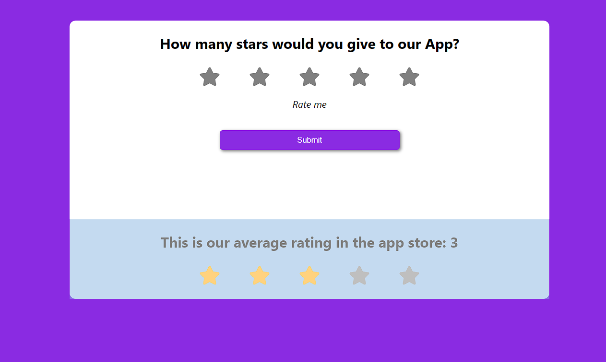

## _React + Vite_

# Front-End Challenge by [FrontEndPro.dev](https://www.frontendpro.dev/)

This is a FrontEnd challenge made with React js.
Basic application featuring star rating.

Information about the challenge such as rules, layout (Figma) are found directly on the website [FrontEndPro.dev](https://www.frontendpro.dev/frontend-coding-challenges/star-rating-component-geShE1ApkqUoNCqujxOd)

In addition to the initial challenge, added rating averaging functionality and useEffect hook for tracking changes in ratings, with data saved to localStorage

To start the application, use 'npm run dev' in the terminal

